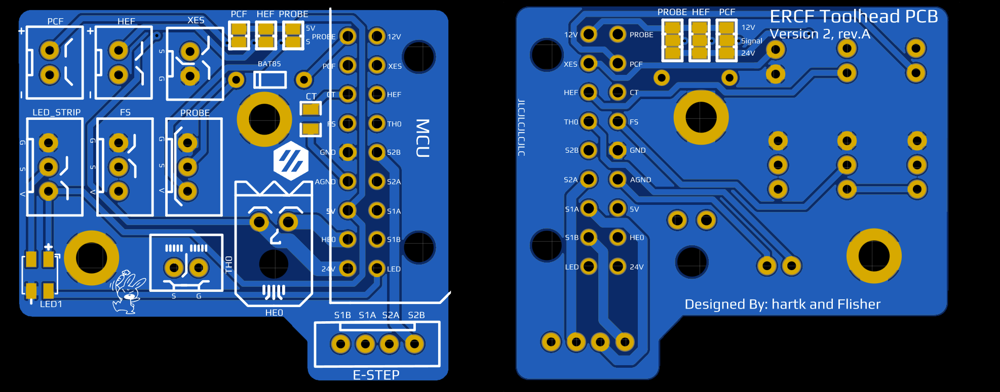
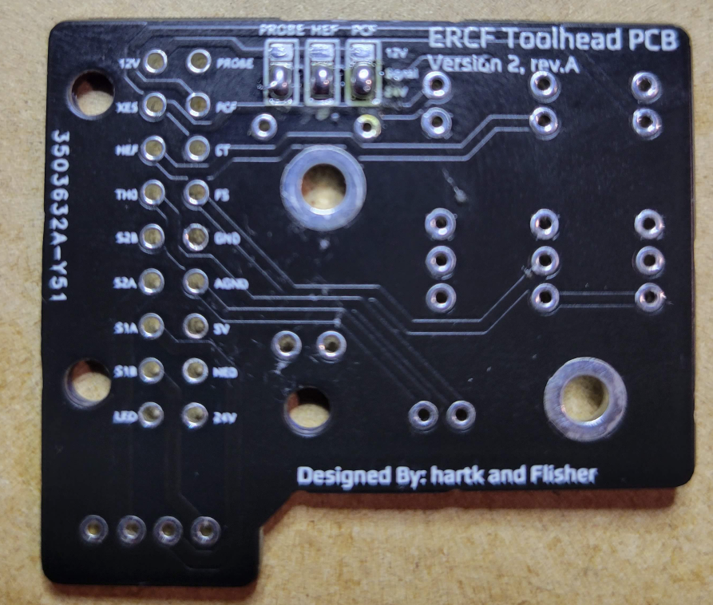
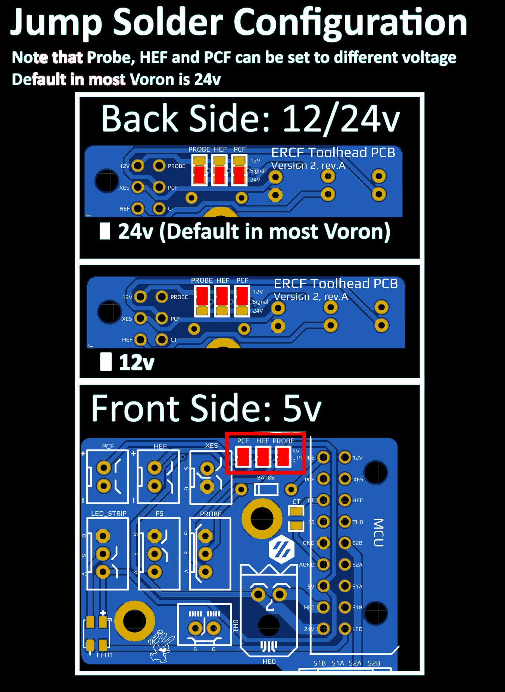

Note that as of 2021-10-22, this PCB was not tested in a live printer.  
The design and trace were reviewed by Flisher and Hart.    
DRC Checking during the design, and continuity test were performed with a real PCB.  
The Neopixel and LED port where tested with success too.  

## ERCFv2

The [wiring diagram](../Images/Rev3.2/wiringDiagram.png) was designed for the regular V4.0 version but you can get an idea of the wiring by looking at it.
 
### Pinout (LEFT ROW FROM TOP)
* PROBE/ABL  - Probe Signal Pin
* PCF  - Part Cooling Fan -V
* CT   - Chamber Thermistor Signal Pin (TH1)
* FS  - Filament Sensor
* GND  - PSU -V (NOT MAINS GND)
* AGND - Hotend Thermistor -V
* 5V   - required for NeoPixel and optional jump solder
* HE0  - Hotend Heater -V    
* 24V  - HE0 +V 

### Pinout (RIGHT ROW FROM TOP)
* 12V - 12 V+
* XES  - X Endstop Signal Pin    
* HEF  - Hotend Cooling Fan -V
* TH0  - Hotend Thermistor Signal Pin (TH0)
* S2B  - Black Stepper Wire 
* S2A  - Green Stepper Wire
* S1A  - Red Stepper Wire
* S1B  - Blue Stepper Wire
* LED  - WS2812 / NeoPixel LED Input Wire
     
## The board features: ##
 - RGB NeoPixel LED, configurable via macro or script.  This LED is the first one of the sequence when using the LED connectors
 - 2/3 pin JST-XH headers for most components on the toolhead JST-XH
 - 0805 pkg thermistor to be used as a chamber temperature 
 - the main wiring harness connector is [Here](https://www.molex.com/molex/products/part-detail/crimp_housings/430451801) <--- to be revised
 - 20awg should be fine for 24v and HE0, 24awg for everything else 

## BOM ##
* a BAT85 Diode for abl probe (Original Afterburner BOM)
* 2 Pins Microfit 3.0 for the heater
   * PCB: [Molex 436500200](https://www.digikey.ca/en/products/detail/molex/0436500200/268989)
   * Wires: [Molex 0436450200](https://www.digikey.ca/en/products/detail/molex/0436450200/268974)
* 18 Pins Microfit 3.0 for the main harness: 
   * PCB: [Molex 0430451801](https://www.digikey.ca/en/products/detail/molex/0430451801/3310258?4)
   * Harness: [Molex 0430251800](https://www.digikey.ca/en/products/detail/molex/0430251800/531407)
* 20 x [Microfit 3.0 Female Crimp 0430300007](https://www.digikey.ca/en/products/detail/molex/0430300007/252479)
* 20 x [Microfit 3.0 Male Crimp 0430310001](https://www.digikey.ca/en/products/detail/molex/0430310001/467798)
* 4 x JST-XH 2 PIN (PCB, wire and crimp)
* 3 x JST-XH 3 PIN (PCB, wire and crimp)
* Same mounting kit and screw than V4.0

## HOW-TO NEOPIXEL ##
You can use any NeoPixel or WS2812 LED macros or configuration already documented for your Voron.

A super simple to use sample of code can be found [here](https://github.com/hartk1213/DoomConfig/blob/master/led.cfg).

## JUIMP SOLDER CONFIGURATION
### WARNING ###
* Please read validate you are jump soldering the right voltage.  Refer to the image below for example
* DO NOT solder jumper 2 differents voltage to the same 
* When soldering 12/24v, doublecheck the connectivity with the unused pad and the middle one to be sure you did not short 12 and 24v together.
 

Example of Solder Solder Jumper for default configuration in most Vorom (24v fan and probe)

