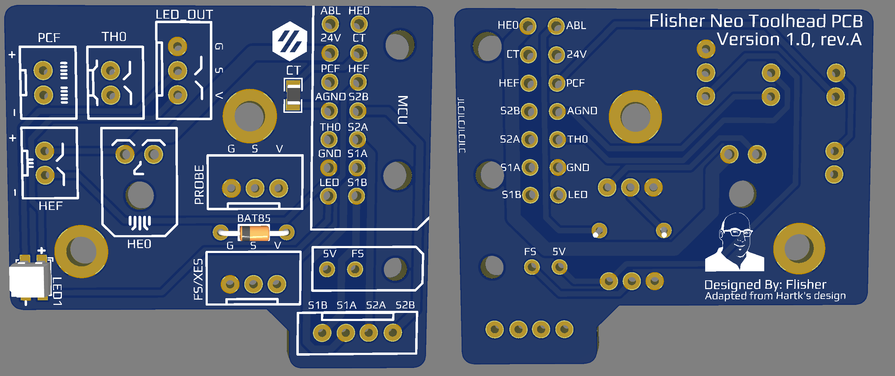

# Flisher's Afterburner Toolhead PCB - Neo v1.0 #
## Description ##
The goal of this PCB was to replace the LED with a NeoPixel and add an additionnal connector for Adressable LED.  
This version is a spiritual successor to both original Hartk Afterburner PCB.  

I created this version of the PCB with the following ideas in mind:
* Maintain Hartk ERCF Toolhead PCB form factor
* Replace the LED by a NeoPixel (WS2812B RGB LED)
* Keep wiring diagram and layout as close as possible to the Hartk's ERCF Toolhead PCB
* Add a jump solder for the BAT85 

I'm FlisherOfatale#0042 on the VORONDesign Discord Server if you need more information.

Comprehensive list of the PCB I know about, comparison are VS Hartk's V4.0
|Model|Feature|Note|Input|Voltage|LED|Designer|
|-|-|-|-|-|-|-|
|3.2|Standard|Mount with M3 washers|14 pins|24v|Red|Hartk|
|[4.0](https://github.com/VoronDesign/Voron-Hardware/tree/master/Afterburner_Toolhead_PCB/)|Standard|Improved traces width|14 pins|24v|Red|Hartk|
|[ERCF](https://github.com/VoronDesign/Voron-Hardware/tree/master/Afterburner_Toolhead_PCB/)|+Filament Sensor|No reason to not use VS 4.0|14+2 pins|5/24v jump solder/cut|Red|Hartk|
|[Neo](./Neo/Production%20Files/)|+Filament Sensor +RGB LED +LED connector +Jump Solder Diode bypass merged XES/FS|Almost an ERCF drop-in alternative Require configuration for LED|14+2 pins|24v 5v LED|RGB|Flisher|

Personal Note: 
* There is no real reason to not use the ERCF VS v4.0, even if you don't have the additionnal 2 wires
* Replacing an ERCF for a Neo should be really simple for the following scenarios with only configuration:
    * ERCF Setup / no XES 
    * Non-ERCF Setup

IMPORTANT:
This PCB reuse most of the ERCF wiring pattern, EXCEPT the XES.  
The XES pin is reused for the LED.  For many person, this won't require any wiring at all, unless XES was used.  
Note that you CANNOT have both XES and FS at the same time with this PCB, considering XES is rarely used, this PCB should be polyvalent enought for most people using Clockwork1 (the original extruder of the Afterburner)

## Pinout ##
### LEFT ROW FROM TOP ##
* PROBE/ABL  - Probe Signal Pin
* 24V  - HE0 +V 
* PCF  - Part Cooling Fan -V
* AGND - Hotend Thermistor -V
* TH0  - Hotend Thermistor Signal Pin (TH0)
* GND  - PSU -V (NOT MAINS GND)
* LED  - WS2812 / NeoPixel LED Input Wire (was XES on Hartk's PCB)

### RIGHT ROW FROM TOP ##
* HE0  - Hotend Heater -V    
* CT   - Chamber Thermistor Signal Pin (TH1)
* HEF  - Hotend Cooling Fan -V
* S2B  - Black Stepper Wire 
* S2A  - Green Stepper Wire
* S1A  - Red Stepper Wire
* S1B  - Blue Stepper Wire

### Microfit 2 pin In:
* 5V   - required for NeoPixel and optional jump solder
* FS  - Filament Sensor / XES - X Endstop Signal Pin

## BOM ##
* a BAT85 Diode for abl probe (Original Afterburner BOM, if required with your MCU)
* 2 Pins Microfit 3.0 for the heater
   * PCB: [Molex 436500200](https://www.digikey.ca/en/products/detail/molex/0436500200/268989)
   * Wires: [Molex 0436450200](https://www.digikey.ca/en/products/detail/molex/0436450200/268974)
* 14 Pins Microfit 3.0 for the main harness: 
   * PCB: [Molex 0430451801](https://www.digikey.ca/en/products/detail/molex/0430451400/531423)
   * Harness: [Molex 0430251800](https://www.digikey.ca/en/products/detail/molex/0430251400/531405)
* 18 x [Microfit 3.0 Female Crimp 0430300007](https://www.digikey.ca/en/products/detail/molex/0430300007/252479)
* 3 x JST-XH 2 PIN (PCB, wire and crimp)
* 3 x JST-XH 3 PIN (PCB, wire and crimp)
* Same mounting kit and screw than [Hartk Afterburner PCB V4.0](https://github.com/VoronDesign/Voron-Hardware/blob/master/Afterburner_Toolhead_PCB)

## WIRING RECOMMENDATION ##
* 20awg should be fine for 24v and HE0 
* 24awg for everything else 
     
## HOW-TO NEOPIXEL ##
You can use any NeoPixel or WS2812 LED macros or configuration already documented for your Voron.

A super simple to use sample of code can be found [here](https://github.com/hartk1213/DoomConfig/blob/master/led.cfg).  
Please reach out to me if you have interesting script to suggest, I'll add them to the repository.  
